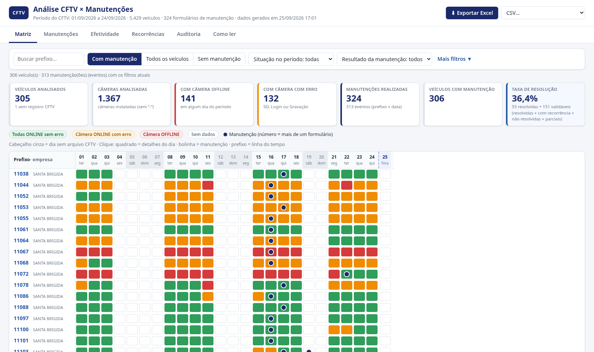

# Análise CFTV × Manutenções

Painel web **estático** que mostra, dia a dia, a situação das câmeras de CFTV de cada veículo (prefixo) e o que aconteceu
**antes, no dia e depois** de cada manutenção registrada pelos técnicos. Assim dá para ver se o problema foi resolvido,
se voltou (recorrência) ou se continuou.

- Período do CFTV: **01/09/2026 a 24/09/2026** (16 relatórios diários; as datas sem arquivo aparecem em branco).
- **5.429 veículos**, 17 empresas, **17.572 câmeras** instaladas, 82.109 registros diários.
- **324 formulários de manutenção** → **313 eventos** (prefixo + data), em **306 veículos**.



## O que o painel mostra

| Aba | Conteúdo |
|---|---|
| **Matriz** (principal) | Uma linha por prefixo, uma coluna por dia. Cor = situação das câmeras: 🟩 todas ONLINE sem erro · 🟧 alguma câmera ONLINE com erro (SD/Login/Gravação) · 🟥 alguma câmera OFFLINE · ⬜ sem dados. 🔵 bolinha azul = manutenção naquele dia (número = mais de um formulário). Passe o mouse para ver cada câmera; clique no quadrado (detalhe do dia), na bolinha (manutenção completa) ou no prefixo (linha do tempo). Abre filtrada em **“Com manutenção” (306)**; o botão **“Todos os veículos”** mostra os 5.430 prefixos (5.429 do CFTV + 1 prefixo só do formulário) sem travar (linhas virtualizadas). |
| **Manutenções** | Lista de todas as manutenções com técnico, câmeras com anomalia, situação antes e resultado. |
| **Efetividade** | Contagem por resultado, taxa de resolução (fórmula visível) e tabelas por técnico, empresa, garagem, câmera, tipo de problema e tipo de intervenção (ordem alfabética, sem ranking). |
| **Recorrências** | Casos em que a mesma câmera voltou a falhar, problemas novos em outra câmera, câmeras com mais dias OFFLINE/erro, tipos de erro e prefixos com mais dias com problema. |
| **Auditoria** | Texto original de cada câmera → interpretação, abas usadas/ignoradas em cada arquivo, inconsistências encontradas e resumo das regras. |
| **Como ler** | Explicação simples do painel. |

Exportação: **Exportar Excel** (planilhas Resumo, Histórico por prefixo, Manutenções, Resultado das manutenções, Recorrências — sempre com os filtros atuais) ou **CSV** de cada planilha.

### Resultado das manutenções

| Resultado | Quando | Eventos |
|---|---|---|
| RESOLVIDO | todas as câmeras com problema antes normalizaram e não voltaram a falhar | 55 |
| RESOLVIDO COM RECORRÊNCIA | normalizaram, mas a mesma câmera voltou a falhar | 12 |
| NÃO RESOLVIDO | nenhuma câmera com problema normalizou | 69 |
| PARCIALMENTE RESOLVIDO | parte normalizou, parte não | 15 |
| SEM DADOS PARA VALIDAR | sem registro antes/depois, fora do período, prefixo fora do CFTV ou **veículo já estava normal antes** (100 casos, com aviso destacado) | 162 |

**Taxa de resolução = RESOLVIDO ÷ (RESOLVIDO + RESOLVIDO COM RECORRÊNCIA + NÃO RESOLVIDO + PARCIALMENTE RESOLVIDO) = 55 ÷ 151 = 36,4%.**
Avisos separados (não mudam o resultado): **Pendência registrada** (17 eventos, com o trecho do formulário) e **Veículo já estava normal antes da manutenção**.
Regras completas: [`REGRAS_PROJETO.md`](REGRAS_PROJETO.md).

## Tecnologia (e por quê)

- **Processamento: Python** (pandas + openpyxl). Lê as planilhas originais, interpreta os textos das câmeras, relaciona com
  o formulário de manutenção e calcula antes/depois/recorrência. Gera bases tratadas em `data/processed/` e **JSON compacto**
  em `site/public/data/` (≈ 4 MB no total).
- **Site: Vite + JavaScript puro** (sem framework) + [SheetJS](https://sheetjs.com) para exportar Excel.
  Escolhido por ser o mais simples e leve para um painel 100% estático: não precisa de servidor, carrega rápido
  (~125 KB de JS compactado) e a matriz usa uma virtualização própria (só as linhas visíveis são desenhadas), o que
  permite mostrar os 5.430 prefixos sem travar.
- **Caminho relativo**: o site é compilado com `base: './'`, então funciona em qualquer endereço do GitHub Pages
  (ex.: `https://<usuario>.github.io/analise-cftv-manutencoes/`). Para forçar um caminho absoluto:
  `BASE_PATH=/analise-cftv-manutencoes/ npm run build`.

## Instalação (uma vez)

Requisitos: Python 3.11+ e Node.js 20.19+.

```bash
python -m venv .venv
source .venv/bin/activate            # Windows: .venv\Scripts\activate
pip install -r requirements.txt
cd site && npm install && cd ..
```

## Ver o painel localmente

```bash
cd site
npm run dev          # desenvolvimento: http://localhost:5173
# ou a versão final:
npm run build && npm run preview     # http://localhost:4173
```

## COMO ATUALIZAR OS DADOS

1. Copie os arquivos novos para `data/raw/` (crie a pasta se não existir):
   - `Relatório CFTV - DD.MM.AAAA.xlsx` (um por dia) e/ou
   - o novo `Revisão_CFTV<data_hora>.xlsx` (se houver mais de um, o **mais recente pelo nome** é usado).
   Os arquivos originais nunca são alterados.
2. Rode o script único de atualização (≈ 1 minuto):
   ```bash
   python scripts/atualizar_dados.py
   ```
   Ele relê tudo, mostra as abas usadas/ignoradas de cada arquivo, regrava `data/processed/` e `site/public/data/`.
   Se chegarem arquivos de datas fora de 01–24/09, o período é ampliado automaticamente.
3. Confira e publique:
   ```bash
   python -m pytest                   # testes das regras (e teste visual, se o site estiver compilado)
   cd site && npm run build           # compila o site em site/dist
   git add -A && git commit -m "Atualiza dados" && git push   # o GitHub Actions publica sozinho
   ```

Scripts auxiliares: `scripts/validacao_manual.py` (validação por amostragem → `docs/VALIDACAO.md`) e
`scripts/capturar_telas.py` (capturas → `docs/screenshots/`). Ambos exigem `site/dist` compilado e Playwright
(`pip install playwright && playwright install chromium`).

## Publicação no GitHub Pages (ainda não executada)

1. Criar o repositório (sugestão: `analise-cftv-manutencoes`) e enviar: `git remote add origin <url> && git push -u origin main`.
2. No GitHub: **Settings → Pages → Build and deployment → Source: GitHub Actions**.
3. O workflow `.github/workflows/deploy.yml` compila `site/` e publica a cada push na `main`.
   O endereço aparece em *Actions → Publicar dashboard* e em *Settings → Pages*.

## Estrutura

```
REGRAS_PROJETO.md          regras de negócio + decisões da usuária (fonte oficial das regras)
README.md
requirements.txt
data/
  raw/                     planilhas originais (NÃO versionadas; nunca alteradas)
  processed/               bases tratadas CSV/XLSX + checksums dos originais
scripts/
  atualizar_dados.py       script único de atualização
  cftv/                    pipeline (config, leitura_cftv, interpretacao, manutencao, analise, exportar)
  validacao_manual.py      fase 13 (amostragem planilha × processado × painel)
  capturar_telas.py        capturas de tela
  servidor_teste.py        servidor local usado pelos testes
  diagnostico/             scripts do diagnóstico inicial (fases 1–4)
site/                      dashboard (Vite)
  public/data/             cftv.json, manutencoes.json, meta.json (gerados)
  src/                     main, matrix, panels, tabs, filters, export, data, util, style
tests/                     pytest: regras obrigatórias (§45) + teste visual
docs/                      especificação, diagnóstico, validação, capturas de tela
.github/workflows/         publicação no GitHub Pages
```

## Dados públicos

A usuária autorizou a publicação dos dados completos. **Ficam públicos** (no site e no repositório):

- **CFTV** (`site/public/data/cftv.json`, `data/processed/cftv_consolidado.xlsx`): prefixo, empresa, data, texto e
  interpretação de cada câmera 21–26, coluna Status (status operacional), coluna Manutenção do CFTV, última transmissão,
  nome do arquivo e linha de origem.
- **Manutenções** (`site/public/data/manutencoes.json`, `data/processed/manutencoes_tratadas.*`, `manutencao_x_cftv.*`,
  `analise_antes_depois.*`, `recorrencias.*`): prefixo, **nome do técnico**, data/hora, ID do formulário, garagem,
  tecnologia do veículo, todas as respostas (problemas, ações, quantidades de câmera/switch/cartão), **observação
  integral do técnico**, **números de série e MACs**, alertas e resultados calculados.
- **Metadados e documentação**: `meta.json` (arquivos/abas, inconsistências), `resumo_arquivos.csv`, `inconsistencias.csv`,
  `docs/` (inclui trechos dos formulários no diagnóstico) e as capturas de tela.

**Não ficam públicos:** as planilhas originais `data/raw/*.xlsx` (não são necessárias para o site), o CSV consolidado de
37 MB (regenerável), arquivos intermediários, `node_modules`, ambientes virtuais, `.env*` e qualquer chave ou token
(o projeto não usa nenhum segredo).
